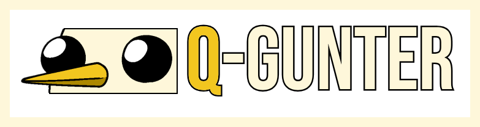

# Q-Gunter — Plataforma de Pentesting Automatizado con IA



**Q-Gunter** es una plataforma SaaS B2B que automatiza las pruebas de penetración mediante inteligencia artificial. Cada cliente despliega una instancia Docker aislada con su propia API key de Anthropic, lanza auditorías desde un CLI ligero y recibe informes de seguridad estructurados — sin configuraciones complejas, sin infraestructura compartida, sin reventa de tokens.

🌐 **Plataforma en producción:** [https://q-gunter.cat](https://q-gunter.cat)

---

## Cómo funciona

1. Solicita acceso en [q-gunter.cat](https://q-gunter.cat) y firma las Reglas de Engagement.
2. Una vez aprobado, crea una instancia y vincula tu API key de Anthropic.
3. Ejecuta el agente CLI desde cualquier máquina Kali Linux mediante Docker:
   ```bash
   docker run -it qgunters/cli-agent:v1.1.0
   ```
4. El agente IA realiza el pentest de forma autónoma — reconocimiento, escaneo, intentos de explotación, registro de findings — y genera un informe completo.
5. Descarga el informe desde el panel web.

---

## Visión general de la arquitectura

- **Frontend (par HA):** Dos nodos Nginx con keepalived sirviendo una SPA en JS vanilla, detrás de Cloudflare CDN/WAF.
- **Backend:** Orchestrator en FastAPI que gestiona contenedores Docker (uno por cliente), enrutamiento WebSocket y almacenamiento de reportes en MinIO.
- **Base de datos (par HA):** Clúster MariaDB para usuarios, instancias, reportes y findings.
- **Agente CLI:** Imagen Docker pública (`qgunters/cli-agent:v1.1.0`) con toolkit de pentesting — nmap, sqlmap, gobuster, dirb — y cliente WebSocket que retransmite las llamadas de herramientas de la IA.
- **Agente IA:** Imagen Docker privada por instancia de cliente, ejecutando un loop de tool-use basado en Claude con capacidad de ejecución bash.

---

## Diferenciadores clave

- **BYO-Key (Bring Your Own Key):** Los clientes usan su propia API key de Anthropic. Q-Gunter nunca revende tokens ni se interpone entre el cliente y el modelo.
- **Multi-tenancy real:** Cada cliente corre en un contenedor Docker completamente aislado. Sin entorno de ejecución compartido.
- **Onboarding rápido:** Del registro al primer pentest en minutos, sin servicios profesionales.
- **Diseñado para el futuro:** El roadmap incluye modelos de IA entrenados localmente y criptografía post-cuántica para la protección de API keys y comunicaciones.

---

## Equipo

| Nombre | Rol |
|---|---|
| Adam Ben Ahmed Belachi | Orchestrator · Agente IA · CLI Docker · Integración Anthropic · Frontend · Documentación legal |
| Raúl Molina Kind | API web · Infraestructura de monitorización · Puesta en producción |
| Ayman Dghoughi Nouri | Infraestructura de red · Frontend HA · MariaDB HA · Cloudflare · MinIO · Seguridad |

---
---

# Q-Gunter — Automated AI Pentesting Platform


**Q-Gunter** is a B2B SaaS platform that automates penetration testing using artificial intelligence. Each client deploys an isolated Docker instance powered by their own Anthropic API key, launches assessments from a lightweight CLI, and receives structured security reports — no complex setup, no shared infrastructure, no token reselling.

🌐 **Live platform:** [https://q-gunter.cat](https://q-gunter.cat)

---

## How it works

1. Request access at [q-gunter.cat](https://q-gunter.cat) and sign the Rules of Engagement.
2. Once approved, create an instance and link your Anthropic API key.
3. Run the CLI agent from any Kali Linux machine via Docker:
   ```bash
   docker run -it qgunters/cli-agent:v1.1.0
   ```
4. The AI agent performs the pentest autonomously — recon, scanning, exploitation attempts, finding registration — and generates a full report.
5. Download the report from the web dashboard.

---

## Architecture overview

- **Frontend (HA pair):** Two Nginx nodes with keepalived serving a vanilla JS SPA, behind Cloudflare CDN/WAF.
- **Backend:** FastAPI orchestrator managing Docker containers (one per client), WebSocket routing, and MinIO report storage.
- **Database (HA pair):** MariaDB cluster for users, instances, reports and findings.
- **CLI agent:** Public Docker image (`qgunters/cli-agent:v1.1.0`) with a full pentesting toolkit — nmap, sqlmap, gobuster, dirb — and a WebSocket client that relays tool calls from the AI.
- **AI agent:** Private Docker image per client instance, running a Claude-based tool-use loop with bash execution capabilities.

---

## Key differentiators

- **BYO-Key (Bring Your Own Key):** Clients use their own Anthropic API key. Q-Gunter never resells tokens or sits between the client and the model.
- **True multi-tenancy:** Each client runs in a fully isolated Docker container. No shared execution environment.
- **Fast onboarding:** From registration to first pentest in minutes, no professional services required.
- **Designed for the future:** Roadmap includes locally-trained AI models and post-quantum cryptography for API key protection and communications.

---

## Team

| Nombre | Rol |
|---|---|
| Adam Ben Ahmed Belachi | Orchestrator · AI Agent · CLI Docker · Anthropic integration · Frontend · Legal docs |
| Raúl Molina Kind | Web API · Monitoring infrastructure · Production deployment |
| Ayman Dghoughi Nouri | Network infrastructure · HA frontend · MariaDB HA · Cloudflare · MinIO · Security |
